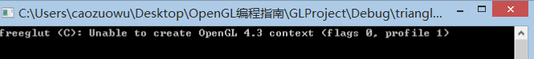

## OpenGL概述
---
###1.1 OpenGL
 * 是一种应用程序编程接口(Application Programming Interface,API)，可以对图形硬件设备访问。
 * OpenGL与硬件无关，拥有很好的可移植性，在多种电脑和移动平台上都可以使用
 * 由于OpenGL与硬件无关，所以它**没有实现应用程序窗口或者处理用户输入操作的的函数也没有表达任何三维物体的模型以及读取图形文件的函数**。上面所说的功能需要根据不同平台的差异性来进行开发，或者使用一些已经写好的工具库例如(glut)。
 * OpenGL使用客户端-服务器的形式实现的，我们编写的程序可以看做客户端，而计算机图形硬件厂商所提供的OpenGL实现可以看做服务器。
 * 总的来说OpenGL是一个底层花的图形接口，它所做的只是把程序设计的图像信息通过硬件平台显示在屏幕上。

###1.2 初识OpenGL程序
渲染(render):从模型创建最终图像的过程。
模型(model):描述渲染物体的模型，一组在空间中的顶点(vertex)的集合，通过集合图元(包括点、线、三角)构建。**也就是说空间中的一些顶点所包围的区域可以理解为一个形状，而用点来构建就是一组点，用线来构建就是一个空框，用三角形来构建就是一个物体的样子了(3.0之后已经没有三角形之外的多边形来构建模型，因为三角形最简单，其他任何多边形都可以由三角形替换)。**
着色器(shader):为图形处理单元(GPU)编译的一种小型程序，从着色器可以创建GPU所需要的编译代码并执行。**就是封装好了的渲染函数**。

####程序triangles，绘制两个三角形
 * 搭建VS2012工程，工程代码如下:    
 
```
// triangles.cpp : 定义控制台应用程序的入口点。
//

#include "stdafx.h"
#include <iostream>
using namespace std;
#include <vgl.h>
#include "loadShaders.h"

enum VAO_IDs
{
	Triangles,
	NumVAOs
};
enum Buffer_IDs
{
	ArrayBuffer,
	NumBuffers
};

enum Attrib_IDs
{
	VPosition = 0
};

GLuint VAOs[NumVAOs];
GLuint Buffers[NumBuffers];

const GLuint NumVertices = 6;

void init(void)
{
	glGenVertexArrays(NumVAOs,VAOs);
	glBindVertexArray(VAOs[Triangles]);

	GLfloat vertices[NumVertices][2] = {
		{-0.90f,-0.90f},
		{ 0.85f,-0.90f},
		{-0.90f, 0.85f},
		{ 0.90f,-0.85f},
		{ 0.90f, 0.90f},
		{-0.85f, 0.90f}
	};

	glGenBuffers(NumBuffers,Buffers);
	glBindBuffer(GL_ARRAY_BUFFER,Buffers[ArrayBuffer]);
	glBufferData(GL_ARRAY_BUFFER,sizeof(vertices),vertices,GL_STATIC_DRAW);

	ShaderInfo shaders[] = {
		{GL_VERTEX_SHADER,"triangles.vert"},
		{GL_FRAGMENT_SHADER,"triangles.frag"},
		{GL_NONE,NULL},
	};

	GLuint program = LoadShaders(shaders);

	glUseProgram(program);

	glVertexAttribPointer(VPosition,2,GL_FLOAT,GL_FALSE,0,BUFFER_OFFSET(0));
	glEnableVertexAttribArray(VPosition);
}

void display(void)
{
	glClear(GL_COLOR_BUFFER_BIT);
	glBindVertexArray(VAOs[Triangles]);
	glDrawArrays(GL_TRIANGLES,0,NumVertices);
	glFlush();
}
//int _tmain(int argc, _TCHAR* argv[])
int _tmain(int argc, char ** argv)
{
	glutInit(&argc,argv);
	glutInitDisplayMode(GLUT_RGBA);
	glutInitWindowSize(512,512);
	glutInitContextVersion(4,3);
	glutInitContextProfile(GLUT_CORE_PROFILE);
	glutCreateWindow("asdfege");

	if (glewInit()){
		cerr<<"Unable to initialize GLEW ... exiting111111111111111111"<<endl;
		exit(EXIT_FAILURE);
	}

	init();
	glutDisplayFunc(display);
	glutMainLoop();

	return 0;
}


```
 * 搭建流程经常性错误
  1. 需要引入示例工程([下载地址](http:://www.opengl.org/resources))中头文件夹(include)和库文件夹(lib)。方法:**右键工程-属性-VC++目录-包含目录添加include文件夹引用，库目录添加lib文件夹引用**，为了方便移动可以使用相对路径$(SolutionDir)为解决方案所在路径。将vgl.h改为绝对引用。
  2. 引入工程之后可能会出现如下错误    
     `>MSVCRTD.lib(cinitexe.obj) : warning LNK4098: 默认库“libcmtd.lib”与其他库的使用冲突；请使用 /NODEFAULTLIB:library`，
  主要原因为工程自动引用的libcmtd.lib与上面引用文件引用的库冲突。解决方法:**右键工程-属性-配置属性-连接器-输入-忽略特定的默认库添加libcmtd.lib，使用另一个库**。
  3. LoadShaders函数为实例工程中作者写的一个函数，在loadShaders.cpp中实现，需要将LoadShaders.h和loadShaders.cpp引入工程中。
  4. 工程编译成功可能出现一闪就退出的现象，具体信息如下图:
      
  主要原因是工程中代码`glutInitContextVersion(4,3);`设定初始化版本为OpenGL4.3而Windows8.1中的版本为OpenGL3.0所以会出现这个问题。解决方法人选如下其一:
     * 注释掉这一行，会使用默认版本的OpenGL初始化。
     * 将这一行改为glutInitContextVersion(3,0)，匹配现有版本。
     * 我还尝试了使用显卡设置让独立显卡来支持编译出来的程序，结果是不会出现上面文字，但是程序会crash，估计是显卡没有响应的驱动程序。无奈诉说教材版本太高......
 

 * 搭建成功运行如图:    
  

 
